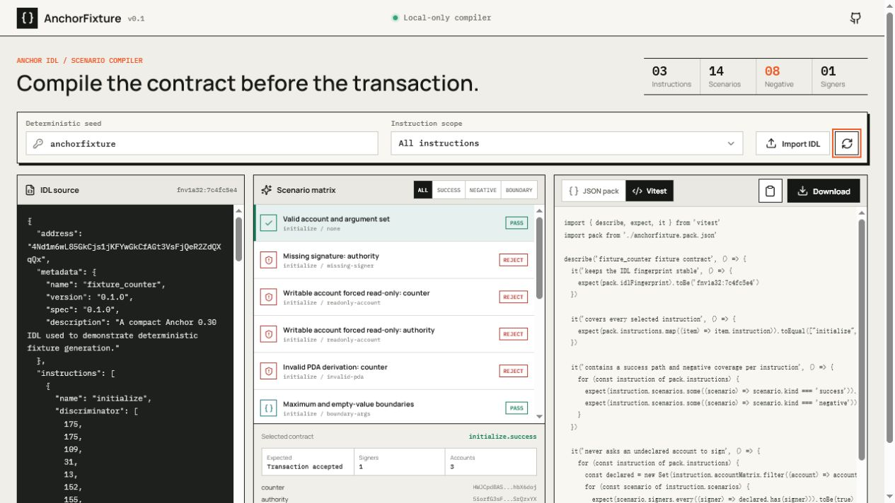

# AnchorFixture

AnchorFixture compiles an Anchor IDL into deterministic transaction fixture contracts for frontends, autonomous agents, and CI. It produces a portable JSON pack plus a Vitest contract that covers valid execution, missing signers, forced read-only accounts, invalid PDAs, and argument boundaries.



## Why it exists

Anchor IDLs describe instruction inputs, but application teams still hand-build the states around those inputs. The expensive failures usually sit at those boundaries: a signer disappears between an agent plan and wallet execution, an account meta loses mutability, a PDA is derived with stale inputs, or generated arguments overflow a client serializer.

SDK generators such as Codama and Solita turn IDLs into clients. AnchorFixture is narrower: it turns an IDL into reproducible success and failure fixtures that every client can consume.

## Outputs

- `anchorfixture.pack.json`: stable program fingerprint, account matrix, arguments, signers, mutations, and expected outcomes.
- `anchorfixture.pack.spec.ts`: Vitest checks for fingerprint stability, instruction coverage, negative coverage, and signer integrity.
- Browser workbench: local-only IDL compilation, filtering, inspection, copying, and download.
- CLI: CI-friendly generation for one instruction or a complete program.

## Quick start

```bash
npm install
npm run fixture -- fixtures/counter-idl.json --out demo-output
npm test
npm run build
```

Filter to one instruction or change the deterministic seed:

```bash
npm run fixture -- fixtures/counter-idl.json --out demo-output --instruction initialize --seed pull-request-42
```

## Fixture schema

Every scenario records the instruction, account public keys, signer paths, generated arguments, mutation, expected outcome, and stable IDL fingerprint. Generated Solana public keys are deterministic for the same IDL, instruction, and seed. Fixed account addresses are preserved.

The versioned output contract is documented in [`schema/anchorfixture.schema.json`](schema/anchorfixture.schema.json).

Supported IDL shapes include Anchor 0.30 `writable`/`signer`, legacy `isMut`/`isSigner`, nested account groups, PDAs, fixed addresses, integer and scalar primitives, options, vectors, arrays, and defined structs/enums.

## Development

```bash
npm run dev
npm run check
npm test
npm run build
```

The web compiler performs all processing locally. It does not upload IDLs or generated fixtures.

## Roadmap

- Executable local-validator adapters that assert program error codes.
- Codama node input and generated TypeScript client adapters.
- Account relationship mutations and PDA seed provenance.
- Machine-readable GitHub Actions report with changed-fixture review gates.

## Grant evidence

The [Agentic Engineering application](docs/GRANT_APPLICATION.md), [submission field map](docs/SUBMISSION_DRAFT.md), and [Codex response package](docs/agentic-engineering-response/PROMPT_RESPONSE.md) are public so scope and claims can be reviewed against the code.

## License

MIT. See [LICENSE](LICENSE).
